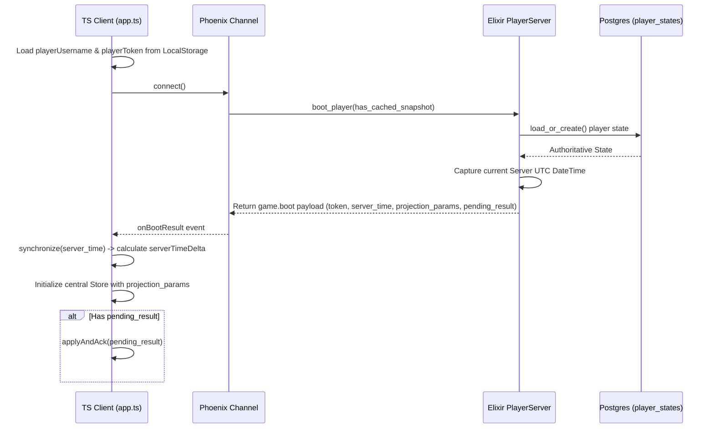

# Step 1: Boot & Synchronization Review Plan

This step governs how the game client loads credentials, establishes a live WebSocket connection via Phoenix Channels, synchronizes its clock to account for network latency/timezones, and boots into the gameplay loop.

## Core Architecture & Responsibilities

### Client (TypeScript)
- **Local Credentials Retrieval**: Accesses `window.localStorage` to load `incrementalist.playerUsername` and `incrementalist.playerToken`. If these are absent, the server will provision them during the handshake.
- **Connection Handshake**: Instantiates `GameChannel` (`assets/src/net/game-channel.ts`) and calls `.connect()`.
- **Clock Drift Alignment**: Captures the server's `server_time` ISO8601 timestamp in the boot payload and calculates the precise clock offset using `synchronize(serverTime)` (`assets/src/core/time.ts`). All subsequent client countdowns, decay calculations, and lerps must call `getServerNow()` instead of `Date.now()`.
- **Authoritative Projection Loading**: Upon receiving `onBootResult`, applies `projection_params` and `idle_mode` parameters directly into the central state projection (`assets/src/core/game-client.ts`).
- **Unresolved commands replay**: Replays any outstanding `pending_result` left unacknowledged from a previous session.

### Server (Elixir)
- **GenServer Session Matching**: Invokes `PlayerServer.boot_player/3` (`lib/incrementalist/game/session/player_server.ex`) to ensure a transient Genserver is running for the player.
- **Player State Sourcing**: Fetches the persistent authoritative `PlayerState` JSONB struct via `PlayerStates.load_or_create/2`.
- **Time Suffixing**: Generates the exact current server time UTC ISO8601 via `Time.iso8601/1` and packages it into the response envelope.
- **Replay Handshake**: Checks the command log for the player's last unacknowledged command (`unacked_command`) and ships it as `pending_result` if present.

---

## Step-by-Step Execution Verification Plan

### 1. Credentials Bootstrapping
- **Verify**: The client successfully retrieves username and token from storage.
- **Verify**: In case of a new player, the client accepts the server's generated username/token and saves them to local storage.

### 2. Time Synchronization Protocol
- **Verify**: `synchronize()` accurately computes `serverTimeDelta = serverMs - localMs`.
- **Verify**: `getServerNow()` is used exclusively across all countdown displays, sisu projection updates, progress loops, and decay timelines. 
- **Rule Check**: Direct calls to `Date.now()` are strictly forbidden in client-side visual timers.

### 3. Replay Verification
- **Verify**: If `pending_result` is returned during boot, the client automatically executes the `applyAndAck` cycle before starting standard ticking.
- **Verify**: The UI shows no visible "jolt" when applying the pending result.
