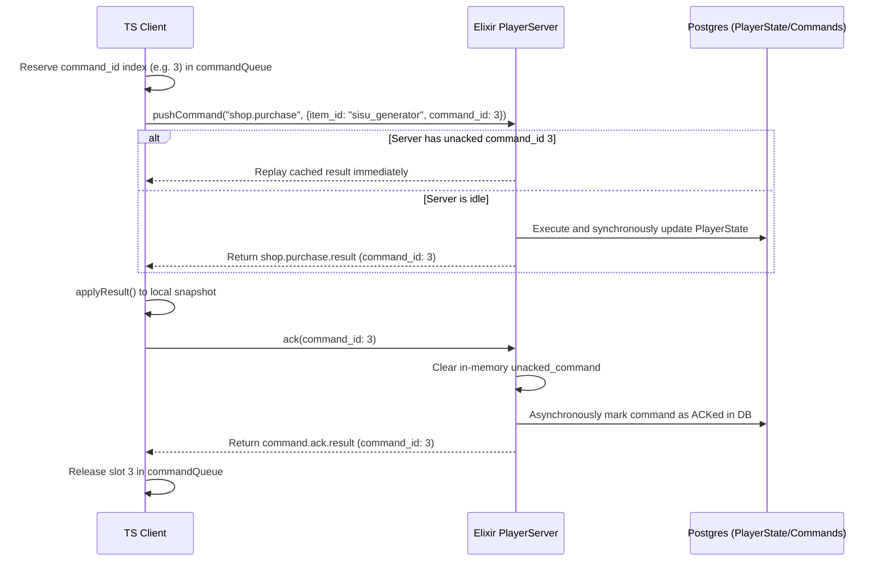

# Step 3: Command Queue & Idempotency Review Plan

This step governs command submission, local command slots, sequence execution boundaries, database saving transactional guarantees, and safe recovery from network crashes/disconnects.

## Core Architecture & Responsibilities

### Client (TypeScript)
- **Local Command Queue**: Maintained in `GameChannel` (`assets/src/net/game-channel.ts`) as a 10-slot boolean array (`commandQueue`). It selects the first free index (`0-9`) as the `command_id` for each outgoing command.
- **Command Dispatching**: Prepares the command payload, stamps it with the reserved `command_id`, and sends it over the channel.
- **Command Acknowledgment**: Emits `ackAppliedResult(channel, command_id)` (`assets/src/net/commands.ts`) after successfully applying the server outcome. This tells the server to release the next queued command.
- **Queue Cleaning on Reset**: Resets the local boolean queue (`clearCommandQueue()`) when a reset command (`game.reset.result`) is executed.

### Server (Elixir)
- **FIFO Live Session Manager (`PlayerServer`)**: Runs as a single GenServer process per player (`lib/incrementalist/game/session/player_server.ex`), guaranteeing that commands are executed strictly in FIFO order.
- **Command Deduplication**: If a command with an existing unacknowledged `command_id` is sent, the server immediately drops execution and replays the cached completed result instead.
- **Idempotence Tracking**: Completed results are stored in-memory inside `PlayerServer` (`unacked_command`) and written asynchronously to the `game_commands` table for audit/replay.
- **Durable Persistence Boundaries**:
  - `player_states` updates (player level, currencies, etc.) are written **synchronously** to the database at save boundaries (reset, disconnect, timeouts).
  - `game_commands` rows are logged as **async audit side-effects** to ensure the GenServer response remains fast.
  - Re-execution of completed commands is strictly prohibited.

---

## Step-by-Step Execution Verification Plan

### 1. In-Flight Command Gating & Queue Limit
- **Verify**: The client successfully utilizes the 10-slot boolean array `commandQueue` as the indices `0` to `9`.
- **Verify**: Sending more than 10 commands in rapid succession (without server responses/ACKs) triggers "Command queue is full" and throws an error on the client before network transmission.
- **Verify**: The local `commandQueue` values are strictly kept in client memory and **never** stored in LocalStorage.

### 2. Live Command Deduplication & Replay
- **Verify**: Simulate network lag or connection loss immediately after a command is sent.
- **Verify**: Upon reconnection, the client retries the unacknowledged command.
- **Verify**: The server (`PlayerServer`) successfully detects the duplicate `command_id` in `unacked_command` and returns the identical, cached result without executing the business logic a second time (proving idempotency).

### 3. FIFO GenServer Command Serialization
- **Verify**: Send multiple different commands (e.g., `shop.purchase` followed by `area.select`).
- **Verify**: `PlayerServer` receives these commands, queues them in sequence order, and executes them one at a time.
- **Verify**: Releasing the unacknowledged command with an ACK triggers the execution of the next queued command.

### 4. Database Persistence Hygiene
- **Verify**: No database row locks (`FOR UPDATE`) are used during gameplay execution.
- **Verify**: `PlayerStates` save boundaries (autosave, disconnect, timeout) correctly write game state JSONB synchronously.
- **Verify**: Command audits (`GameCommand`) are saved asynchronously.
