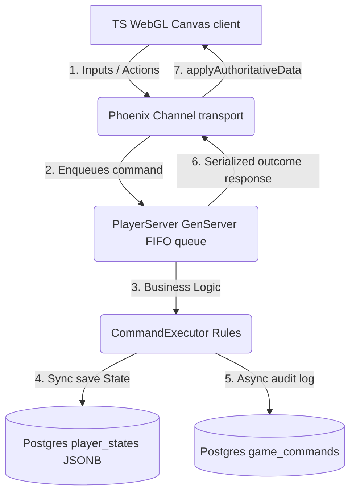

# Full Game Loop Step-by-Step Review Plan

Welcome to the comprehensive, step-by-step review plan for **Incrementalist**. This plan maps the active game loop, detailing how visual client projection (TypeScript/WebGL) integrates with the authoritative gameplay engine (Elixir/Phoenix Channels/GenServer).

---

## Game Loop Architecture Map

The interaction between client projection, in-memory GenServer serialization, and database persistence follows this structural hierarchy:

---

## Detailed Step-by-Step Reviews

The complete gameplay flow is divided into 9 isolated, reviewable phases. Each file contains precise component mappings, server interactions, verification tests, and code check rules:

1. **[Boot & Connection Synchronization](file:///Users/timothy/incrementalist/%21plans/Full%20review/01_boot_and_synchronization.md)**
   * *Focus*: Token handshake, Phoenix topic joins, clock drift offset computations using UTC, and pending command replay.
2. **[Visual Snapshot Caching](file:///Users/timothy/incrementalist/%21plans/Full%20review/02_local_snapshot_caching.md)**
   * *Focus*: Non-authoritative LocalStorage cache loading for instant visual boots, handshake indicators, and server reconciliation.
3. **[Live Command Queuing & Idempotency](file:///Users/timothy/incrementalist/%21plans/Full%20review/03_command_queue_and_idempotency.md)**
   * *Focus*: GenServer FIFO queue pipeline, command deduplication, 10-slot local array limits, and the unacknowledged ACK-gating protocol.
4. **[Progress Bar Projections](file:///Users/timothy/incrementalist/%21plans/Full%20review/04_progress_accumulation_and_projection.md)**
   * *Focus*: Accumulation rates, active/idle settings, level-up multipliers, Sisu multiplier boosts, and client-side timeline lerping.
5. **[Reward Collection Mechanics](file:///Users/timothy/incrementalist/%21plans/Full%20review/05_reward_claiming_mechanics.md)**
   * *Focus*: Non-swallowing activity click tests, idle auto-collection, and the asynchronous wait-retry loop for the server `claim_not_ready` transition.
6. **[Bonus Time Rotations](file:///Users/timothy/incrementalist/%21plans/Full%20review/06_bonus_time_rotation_and_games.md)**
   * *Focus*: Streaks, daily tokens, 12-hour game rotations, Chest Draw rolling algorithms, minimum 1.5s visual reveals, and hidden outcomes rules.
7. **[Sisu Generator & Refilling](file:///Users/timothy/incrementalist/%21plans/Full%20review/07_sisu_generator_and_refills.md)**
   * *Focus*: Multi-tier radial meter arcs, crystal refill validations, Sisu decay steps, diminishment softening multipliers, and 3D glass ball overlays.
8. **[Notices & Notification markers](file:///Users/timothy/incrementalist/%21plans/Full%20review/08_notifications_and_notices.md)**
   * *Focus*: Hierarchical parent/leaf bubbling nodes, shown/clicked visibility acknowledgments, and real-time multi-client synchronization.
9. **[BigNum Math & Precision](file:///Users/timothy/incrementalist/%21plans/Full%20review/09_bignum_math_and_precision.md)**
   * *Focus*: Mantissa/exponent bounds `{m, e}`, pure math library validations, underflow cutoffs, and dual-mode suffixed/scientific formatters.
10. **[Quests Engine & Claiming](file:///Users/timothy/incrementalist/%21plans/Full%20review/10_quests.md)**
    * *Focus*: Quest ranks, requirements evaluation, scrolling panels cards list, and downstream cascading re-evaluation claims.
11. **[Achievements Unlocking](file:///Users/timothy/incrementalist/%21plans/Full%20review/11_achievements.md)**
    * *Focus*: Unlocked timestamp evaluations,Outfit styling cards, and direct multiplier linkage boosting the progress bar's coin claim payouts.
12. **[Basic Shop feature Purchases](file:///Users/timothy/incrementalist/%21plans/Full%20review/12_basic_shop.md)**
    * *Focus*: Level gates, Coin/Shard/Core cost validation checks, and feature locks bottom-hud updates.
13. **[Locked Items Overlays](file:///Users/timothy/incrementalist/%21plans/Full%20review/13_locked_items.md)**
    * *Focus*: Locked element overlays (`drawLockedElement`), alpha dimming gates (`withLockedAlpha`), circular vs rectangular pointer bounds, and unlock requirement hover tooltips.
14. **[WebGL Renderer & Troika Text](file:///Users/timothy/incrementalist/%21plans/Full%20review/14_webgl_and_troika_rendering.md)**
    * *Focus*: Direct WebGL shader compilations (GPU liquid waves, multi-layer glow rects, arc shapes), Three.js context binding, Troika vector typography meshes, text cache limits, and flicker protections.

---

## Review Plan Rules & Directives

> [!IMPORTANT]
> **No backward-compatibility layers**: The game is under development. If schemas or fields change, reset development databases (`mix ecto.reset`) instead of maintaining compatibility shims.

> [!WARNING]
> **Authoritative Server Rule**: The server owns truth; the client owns projection. The client is forbidden from calculating or authorizing gameplay outcomes.

> [!TIP]
> Use this step-by-step checklist to verify features locally and write integration test suites that cover each boundary.
