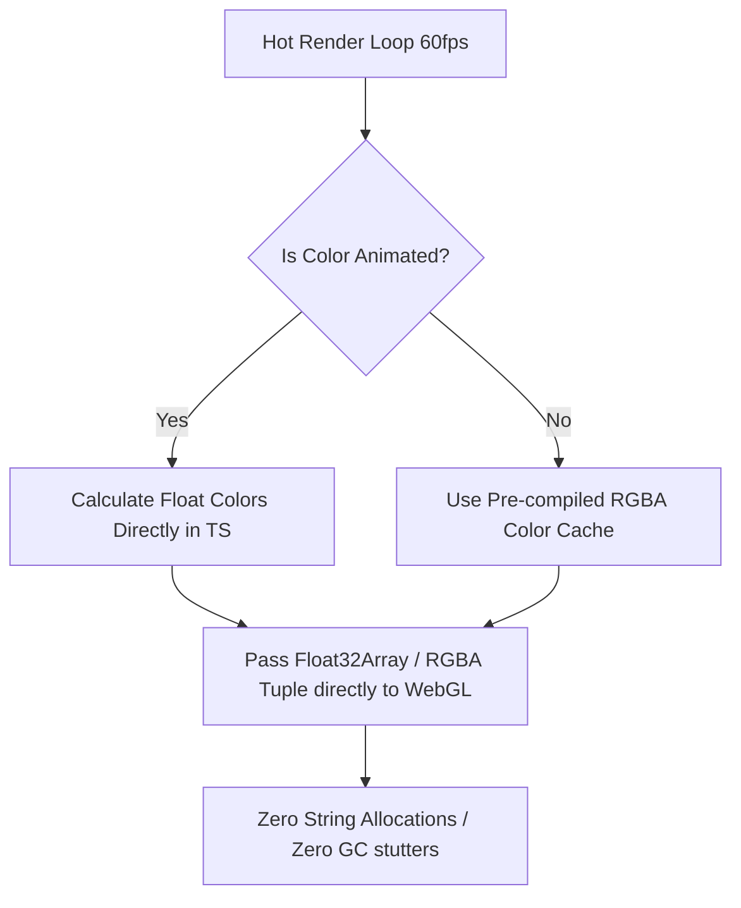

# Plan: Fix High-Frequency DOM String Allocations & Regex Parsing

## Objective
Optimize hot rendering paths on the canvas/WebGL by eliminating runtime string allocations, CSS HSL/RGB template strings, and active RegExp color parsers in `render.ts` modules. These operations currently run at 60 FPS, causing unnecessary CPU overhead and garbage collection (GC) pauses.

---

## 1. Problem Definition
In the WebGL rendering cycle, features frequently construct dynamic colors using string templates (specifically for animations, rotations, and glows):
```typescript
const hue = (now % 1000) / 1000 * 360;
const colorStr = `hsl(${hue}, 80%, 50%)`;
```
These strings are passed to the renderer, which does:
```typescript
export function cssToRgba(css: string): RGBA {
  const normalized = String(css || "").trim().toLowerCase();
  ...
  if (normalized.startsWith("hsl")) {
    const matches = normalized.match(/hsl\(([\d.]+),\s*([\d.]+)%,\s*([\d.]+)%\)/);
    ...
  }
}
```
This pattern introduces three major performance bottlenecks:
1. **String Allocation**: Creating multiple dynamic color strings every frame allocates heap memory.
2. **Regex Parsing**: Executing `RegExp.exec()` at 60 FPS consumes CPU cycles.
3. **Garbage Collection Pressure**: Thousands of small short-lived objects are created and discarded every second, triggering frequent micro-GC sweeps that stutter frames (micro-stuttering).

---

## 2. Proposed Architecture

We will implement a zero-allocation, pre-calculated, or direct mathematical conversion architecture.



### Step 1: Implement direct TS Math for HSL to RGB
Instead of outputting HSL strings, add a utility to calculate the normalized `RGBA` tuple (`[number, number, number, number]`) directly from HSL floats.

```typescript
// assets/src/utils/color.ts
export function hslToRgb(h: number, s: number, l: number, a = 1.0): RGBA {
  const c = (1 - Math.abs(2 * l - 1)) * s;
  const x = c * (1 - Math.abs((h / 60) % 2 - 1));
  const m = l - c / 2;
  let r = 0, g = 0, b = 0;

  if (h < 60) { r = c; g = x; b = 0; }
  else if (h < 120) { r = x; g = c; b = 0; }
  else if (h < 180) { r = 0; g = c; b = x; }
  else if (h < 240) { r = 0; g = x; b = c; }
  else if (h < 300) { r = x; g = 0; b = c; }
  else { r = c; g = 0; b = x; }

  return [r + m, g + m, b + m, a];
}
```

### Step 2: Update Hot Render Calls to Use Numeric Tuples
Replace dynamic template HSL/RGB strings in all `render.ts` files with numeric HSL evaluations:

* **Before**:
  ```typescript
  const hue = (now % 1000) / 1000 * 360;
  const color = cssToRgba(`hsl(${hue}, 80%, 50%)`);
  ```
* **After**:
  ```typescript
  const hue = (now % 1000) / 1000 * 360;
  const color = hslToRgb(hue, 0.8, 0.5); // Zero string allocations!
  ```

### Step 3: Implement an Immutable Static Color Registry
For non-dynamic colors (e.g. static UI borders, panels, text), avoid calls to `hexToRgba` or `cssToRgba` in the render loop by exporting pre-parsed static `RGBA` values from a centralized color module:

```typescript
// assets/src/colors.ts
export const RGBA_COLORS = {
  panel: {
    bg: hexToRgba("#1a202c"),
    border: hexToRgba("#2d3748")
  },
  accent: {
    blue: hexToRgba("#3182ce"),
    green: hexToRgba("#48bb78")
  }
} as const;
```

---

## 3. Implementation Steps & Verification
1. **Refactor `assets/src/utils/color.ts`**:
   Expose optimized, non-string numeric color converter methods (`hslToRgb`).
2. **Refactor Daily Bonus Render Modules**:
   * Update `assets/src/features/bonustime/jackpot-meter/render.ts`.
   * Update `assets/src/features/bonustime/02-prize-wheel/render.ts` (wheel rotations).
3. **Verify compile checks**:
   Run `npm run build` or `npx tsc --noEmit` to ensure type checks pass across all modified source files.
4. **Performance Benchmark**:
   Monitor Chrome DevTools Performance tab to verify heap allocations dropped, heap graph remains flat, and garbage collector time decreases to `<0.1ms`.
